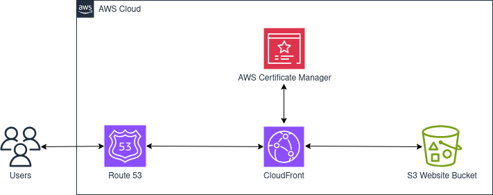

# Terraform Static S3 Website with CloudFront 
The Terraform script in this repository creates the resources for a static S3 website with a CloudFront distribution. Components include S3 buckets to store website content and logging data; a CloudFront distribution pointing to the S3 origin bucket; Route 53 records to associate a subdomain with the CloudFront distribution; and an ACM X.509 certificate to enable secure communications via SSL/TLS.

The architectural diagram below shows the resources created by the script.



Before launching the script, review the potential cost of the resources that will be created. In particular, while S3 buckets and CloudFront distributions are free tier eligible, such resources may incur costs once certain usage thresholds are met. Please refer to the [Amazon Pricing](https://aws.amazon.com/pricing/) page for specific regional pricing.  

## Script Overview
The [main.tf](./main.tf) script calls the `s3_website` module, which creates the S3 buckets, CloudFront distribution, Route 53 records, and ACM X.509 certificate, as described in detail below. 

### S3 Buckets
The script creates two S3 Buckets, one for website files and another for log files. For the website files bucket, the script uses a Terraform `for_each` meta-argument to read the contents of the directory identfied by the `source_files` variable, and then uploads each file to the S3 bucket. The bucket is configured as a static website, with index.html identified as the index document and error.html as the custom error document. Following security best practices, public access is blocked on the bucket, and an IAM policy document is applied, which policy limits bucket access to only the CloudFront service. Bucket actions are restricted to GetObject and ListBucket.

To provide a complete stand-alone solution, the Terraform script creates a logging bucket specifically for the CloudFront distribution. The Terraform `force_destroy` argument for the logging bucket is set to `true` so that all of the script resources are deleted when the `terraform destroy` command is issued. To avoid losing log files, this argument can be changed to `false`. The script can also be modified to point to an existing logging bucket if preferred. 

### CloudFront Distribution
A CloudFront Distribution is created that uses the S3 website bucket as its origin. CloudFront Origin Access Control (OAC) secures the S3 origin by limiting access to only the designated distribution. To retain detailed user request data, the distribution saves standard logs to the S3 logging bucket. While no geographic restrictions are imposed, a restrictions block is included in the script to support the addition of custom constraints in the future.

CloudFront supports custom error pages for certain client and server error HTTP status codes, specifically 400, 403, 404, 405, 414, 416, 500, 501, 502, 503, and 504. (See the [AWS Documentation](https://docs.aws.amazon.com/AmazonCloudFront/latest/DeveloperGuide/creating-custom-error-pages.html) for more information.) Following the best practice of limiting internal error messages, e.g. [OWASP Improper Error Handling](https://owasp.org/www-community/Improper_Error_Handling), the script uses a dynamic block with a `for_each` meta-argument to create custom error responses for each of these HTTP status codes. All responses return the same custom error page (error.html), but specific pages for each response code could be implemented by modifying the `http_response` variable to support a list of maps and adding a key-value pair to store the name of the specific error page.

Because SSL/TLS is configured for communication with users, the default cache behavior sets the view protocol policy to Redirect HTTP to HTTPS, ensuring that HTTP `GET` and `HEAD` request are automatically redirected to HTTPS. The distribution's custom SSL certificate value is configured for the ACM certificate created by the Terraform script (see ACM X.509 Certificate section below), and the distribution's security policy value is set to TLSv1.2_2021, which is the most recent version of the TLS protocol supported by CloudFront.

### Route 53 Records
Two Route 53 records are created, both in the Hosted Zone identified by the `zone_id` variable in the `dev.tfvars` file. The first record added is a CNAME record. This record is created by mapping the name, record, and type fields from the ACM certificate's corresponding CNAME record, which record is automatically created because the ACM certificate's validation method is set to DNS.

The second record added is an A record for the subdomain identified by the `domain` variable in the `dev.tfvars` file. This record serves as an alias to the CloudFront distribution.

To reduce costs, there is no resource block to create a Hosted Zone. Instead, the script assumes that a Hosted Zone for the primary domain already exits and that the domain being created is a subdomain, e.g. subdomain.primarydomain.com. 

### ACM X.509 Certificate
One X.509 certificate is created for the subdomain. Because the validation method is DNS, a CNAME record is created for the certificate. (See the [AWS Documentation](https://docs.aws.amazon.com/acm/latest/userguide/dns-validation.html) for more information.)

The resource block includes a Terraform `lifecycle` meta-argument that sets `create_before_destroy` to `true`. This prevents any outage when a new certificate replaces an old certificate.

### Root Module Variables
For customization, the root module `variables.tf` file declares the following variables:

|Variable|Description|
|--------|-----------|
|zone_id|ID of the AWS Hosted Zone where the Route 53 records will be created.|
|domain|Domain name of the website.|
|source_files|Directory location of the website files.|
|profile|Profile for the Terraform AWS provider.| 
|env|DevOps environment.|
|region|Region for the Terraform AWS provider.|

Variable values are stored in the `dev.tfvars` file. Following Terraform best practices, variables for other environments should be stored in separate files, e.g. `test.tfvars`, `prod.tfvars`, or similar.

## Getting Started

### Dependencies

+ Terraform (For installation instructions, [click here](https://developer.hashicorp.com/terraform/tutorials/aws-get-started/install-cli).)
+ AWS CLI (For installation instructions, [click here](https://docs.aws.amazon.com/cli/latest/userguide/getting-started-install.html).)
+ Established connection to an AWS account

### Installation
To install the script, either clone the [terraform-s3-cloudfront](.) repo or download the files to the local host. 

## Usage
As a preliminary step, modify the `dev.tfvars` as appropriate for the current environment. Of particular importance, the `zone_id` variable must be updated to include the ID of an existing Hosted Zone and the `domain` variable must be updated to a subdomain of the primary domain associated with the Hosted Zone. The [dev.tfvars](./dev.tfvars) file in the repository has placeholder values for these variables.

To run the script, follow standard Terraform practices by navigating to the directory that holds the `main.tf` script, then running the commands to initialize and apply the script:

```bash
terraform init
terraform plan -var-file="dev.tfvars"
terraform apply -var-file="dev.tfvars"
```

## License
Licensed under the [GNU General Public License v3.0](./LICENSE).
